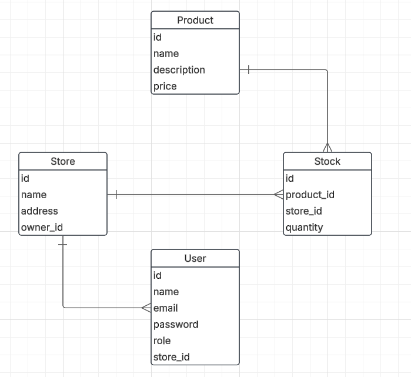

<h1 align="left">Project Stock Service</h1>

###

This project is intended to be part of my portfolio. With this project, I intend to improve my basic skills in Node.js, creating a stock service. AI was used ⚠️

###

<h2 align="left">IA use</h2>

###

With the help of the AI, I documented the swagger through comments and used it for some testing issues, such as improving mocks, clearing up doubts about how to set certain jest.mocks and the like.

###

<h3 align="left">AI's used</h3>

    "Cursor"
    "Claude 3.7 Sonnet"

###

<h2 align="left">History</h2>

###

To develop this API, I imagined the following situation:  <i>A small company contacted me to develop an inventory system for them.</i> <i>The company has more than one physical store, franchise-style, and its stock must be visible between stores.</i> <i>To use this system, it is also necessary to have a login.</i>  With this in mind, the following diagram was created:

###

<h2 align="left">Application</h2>

###

<h3 align="left">Dependencies</h3>

###

    "bcrypt": "^5.1.1",
    "body-parse": "^0.1.0",
    "config": "^3.3.12",
    "consign": "^0.1.6",
    "cors": "^2.8.5",
    "dotenv": "^16.4.7",
    "express": "^4.21.2",
    "helmet": "^8.1.0",
    "joi": "^17.13.3",
    "jsonwebtoken": "^9.0.2",
    "sequelize": "^6.37.7",
    "sqlite3": "^5.1.7"

###

<h4 align="left">DEV Dependencies</h4>

###

    "nodemon": "^3.1.9",
    "sequelize-cli": "^6.6.2"

###

<h3 align="left">To run the project</h3>

###

    "start": "node server.js",
    "dev": "nodemon server.js",
    "test": "jest --detectOpenHandles",
    "test:coverage": "jest --coverage"

###

<h2 align="left">I code with</h2>

###

  
  
  
  
  
  
  

###
